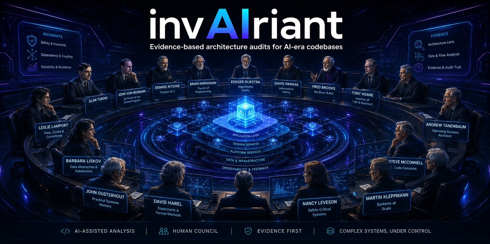

<div align="center">

<a href="./thumbnail.jpg"></a>

<br/>

[](https://github.com/mindicator/invairiant/actions/workflows/validate.yml)
[](LICENSE)
[](https://github.com/mindicator/invairiant/releases/tag/v0.1.0)
[](docs/lens-taxonomy.md)
[](lenses/)
[](skill/SKILL.md)
[](AGENTS.md)
[](.cursor/rules/invairiant.mdc)
[](docs/evidence-rules.md)
[](docs/evidence-rules.md)

**Evidence-based, multi-lens architecture audits for systems that must not drift.**

`AI-assisted analysis` · `human council` · `evidence first` · `complex systems, under control`

<sub>a protocol by <b>mindicator &amp; silicon bags quartet</b></sub>

</div>

---

## No evidence. No finding.

invAIriant turns senior-engineer judgment into a **reusable audit protocol**:
named lenses, evidence rules, a severity model, JSON schemas, report
templates, and AI-ready prompts — for complex software systems, especially
systems built with AI assistance, where architectural invariants have to
survive rapid change.

The council in the banner is not decoration. Each seat is a **lens** — a named
school of questioning (Parnas → information hiding; Turing → termination and
oracle boundaries; Lamport → time and ordering; Leveson → unsafe control). AI
assistants can convene that whole council against your diff in minutes. The
one rule that keeps it honest:

> **AI may propose hypotheses. Only evidence-backed, verified claims become
> findings.** A high average score never cancels a critical finding, and a
> rejected hypothesis is kept in the report — never silently dropped, never
> silently promoted.

## Quick start

**Primary — the agent skill.** Install it, then audit from the agent:

```bash
mkdir -p .claude/skills && ln -s "$PWD/skill" .claude/skills/invairiant
# then, in the agent:
#   /invairiant audit-pr        # audit the current diff/PR → a PR comment
#   /invairiant full-audit      # whole repo, mandatory lenses → a report
```

Same protocol in **Codex** (root [`AGENTS.md`](AGENTS.md)) and **Cursor**
([`.cursor/rules/`](.cursor/rules/invairiant.mdc)) — just ask for an
"invAIriant audit-pr." Per-agent install: [skill/README.md](skill/README.md).

**Helper — the CLI seatbelt** (never audits — no lenses, findings, or scores):

```bash
pip install -e .                                        # the `invairiant` command
invairiant init --type infra-service                    # scaffold the config
invairiant collect --out .invairiant/cache/bundle.json  # evidence bundle
invairiant ci-gate docs/audits/x.json                   # fail CI on open S0/S1
```

See the **[full demo flow](docs/demo.md)** — `collect → audit-pr → report →
render-comment → record` — with real output. No tooling at all? Run the
protocol by hand from [`examples/`](examples/) +
[docs/audit-workflow.md](docs/audit-workflow.md).

## How it works — the four-stage pipeline

Every audit, from a PR to a full-scale review, runs the same pipeline with
**hard boundaries between stages** so AI volume becomes signal instead of
noise. Each stage maps to a prompt in [`prompts/`](prompts/).

```text
   inputs: diff / repo @ commit, canonical docs, config, tool outputs
                              │
  [1] LENS PASS               │  one selected lens per pass
      lens auditor            ▼  → score (0–10) + candidate findings + hypotheses
                              │
  [2] EVIDENCE VERIFICATION   │  adversarial: try to REFUTE each candidate
      evidence verifier       ▼  → verified │ rejected │ demoted   (nothing dropped)
                              │
  [3] SEVERITY CLASSIFICATION │  rules, not averages
      severity classifier     ▼  → S0 / S1 / S2 / S3 / NOTE
                              │
  [4] SYNTHESIS               │  rejected hypotheses stay visible
      report synthesizer      ▼  → audit report + verdict (pass / conditions / fail)
```

- Stage 1 may not assign final severity. Stage 2 may not invent findings.
  Stage 3 touches only verified findings. Stage 4 may not drop a rejected
  hypothesis.
- Skills, scanners, and test suites plug in as **evidence adapters** — their
  output enters as *candidate evidence*, never as findings on their own
  authority ([docs/evidence-rules.md §7](docs/evidence-rules.md)).

## The lens council

A **lens** is a named school of questioning with a fixed structure: purpose,
scope, core questions, good-state examples, red flags, required evidence, a
0–10 rubric, finding examples, and a ready-to-paste AI prompt block. Lenses
are grouped into **opt-in packs** so audits select by risk surface, not by
famous name — **default audits use 4–6 lenses, not 20.**

| Pack | For | Lenses |
|---|---|---|
| [**core**](lenses/core/) | most non-trivial codebases | Cormen · Parnas · Brooks · Dijkstra · McConnell · Turing |
| [**systems**](lenses/systems/) | infra, runtime, distributed, stateful | Tanenbaum · von Neumann · Lamport · Harel · Kleppmann |
| [**implementation**](lenses/implementation/) | code-level engineering quality | Ritchie · Kernighan · Ousterhout · Liskov |
| [**correctness**](lenses/correctness/) | correctness-sensitive systems | Hoare (+ cross-listed Cormen · Turing · Harel) |
| [**security-safety**](lenses/security-safety/) | security, privacy, safety, autonomy | Saltzer–Schroeder · Leveson · Security/Threat · Privacy · Operational-Resilience |
| [**ai-generated-code**](lenses/ai-generated-code/) | AI-era codebases (first-class) | Oracle-Boundary · Prompt–Code-Drift · Generated-Surface-Area · Review-Bottleneck |
| [**domain**](lenses/domain/) | opt-in, domain-specific | Network-Persistence · Distributed-Systems · Product-Operability |

> **Lens names are mnemonic devices, not appeals to authority.** A finding is
> right because of its evidence, never because of the name on the lens. Full
> taxonomy and per-project selection guide: [docs/lens-taxonomy.md](docs/lens-taxonomy.md).

## What it is, in one layer diagram

invAIriant is an **audit discipline layer for AI-era software engineering** —
not another CLI auditor. The market for those is full (Semgrep, CodeQL, Sonar,
linters, dependency scanners); the fresh niche is a *protocol for AI-assisted
architectural judgment*. So the product is the skill, and everything else
supports it.

| Layer | What it is | Status |
|---|---|---|
| **① Primary — the agent skill** | [`/invairiant`](skill/SKILL.md): an LLM coding agent runs the audit. Commands: `audit-pr`, `full-audit`, `verify-findings`, `classify-severity`, `synthesize-report`, `closure-verification`. **This is the product.** | ✅ usable now |
| **② Secondary — the protocol layer** | [schemas](schemas/) + [templates](templates/) + [prompt pack](prompts/) + [lenses](lenses/) — the reusable contract the skill (or a human) stands on. | ✅ usable now |
| **③ Helper — a narrow CLI** | [`invairiant`](docs/cli.md): `init`, `collect`, `validate-config`, `validate-report`, `render-report`, `render-comment`, `ci-gate`, `record`, `history`. **It serves the audit; it never performs one** — no lenses, no findings, no scores. | ✅ reference impl |

**Does it pull in other skills?** Yes — by design it *orchestrates* rather
than *reinvents*. Security scanners, code-review skills, dependency auditors,
and test runners are **evidence adapters**: the skill (often via
`invairiant collect`) runs them, ingests their output as candidate
evidence, and subjects it to the same verification as any human claim. It is
the connective protocol that binds evidence, lenses, severity, and
AI-assisted review into one auditable trail — not a replacement for the tools
it consumes.

## See it catch what a reviewer misses

Four worked [**case studies**](case-studies/) — one from a **real** diff,
three illustrative — each shows the diff, the chosen lenses, the verified
findings, the *kept* rejected hypotheses, and a side-by-side of what a generic
AI reviewer said versus what the lens caught:

- [**persistent-mesh-transport**](case-studies/persistent-mesh-transport/) *(real)* — a documented
  "fail-closed" TLS fallback that actually ships an active-probe tell; the
  finding's recommendation is the real fix that landed.
- [**ai-agent-refund-bot**](case-studies/ai-agent-refund-bot/) — model output
  moves customer money with no cap or validation (S0).
- [**generated-typescript-api**](case-studies/generated-typescript-api/) — one
  near-duplicate handler silently drops an authz check (S1).
- [**p2p-network-transport-change**](case-studies/p2p-network-transport-change/)
  — an ordering assumption plus a distinguishable handshake fingerprint (S1).

## Evidence rules, in one screen

Valid evidence — `file path + line range` · `diff hunk` · `test failure` ·
`missing test` · `doc/code contradiction` · `CI output` · `runtime log` ·
`incident` · `reproducible command output` · `schema/config mismatch`.

Not evidence — "looks risky" · "probably overcomplicated" · "AI may have
generated this" · "feels wrong" · a lens name without the concrete leak · a
tool warning by itself.

Everything unsupported is recorded as an **observation**, **hypothesis**, or
**open question** — never as a finding. Full rules:
[docs/evidence-rules.md](docs/evidence-rules.md).

## Severity model, in one screen

| | Meaning | Gate |
|---|---|---|
| **S0** | Critical | blocks merge / release / phase transition |
| **S1** | High | fix before the next major step |
| **S2** | Medium | next work cycle |
| **S3** | Low | planned improvement |
| **NOTE** | Note | no mandatory action |

Scores map to severity by fixed rules (mandatory lens < 6.0 → ≥ S2; critical
lens < 5.0 with concrete user risk → S0), and **a high average never launders
a critical finding.** Full model: [docs/severity-model.md](docs/severity-model.md).

## Repository layout

```text
README.md                this file
skill/                   ① the /invairiant agent skill — the primary product
docs/                    methodology · evidence-rules · severity-model ·
                         audit-workflow · lens-taxonomy · cli · related-work
lenses/                  the lens library (7 packs, 28 lenses)
templates/               audit-report · finding · pr-comment ·
                         phase-transition-audit · event-triggered-audit
schemas/                 finding · audit-report · lens · config ·
                         evidence-bundle  (JSON Schema)
prompts/                 lens-auditor · evidence-verifier ·
                         severity-classifier · report-synthesizer
cli/                     ③ the narrow invairiant CLI (serves the audit)
case-studies/            worked audits — 1 real (persistent-mesh-transport) + 3 illustrative
examples/                minimal-webapp · infra-service · ai-agent-system
.invairiant/history/     committed, sanitized audit memory (record / history)
.github/workflows/       framework self-validation
```

## Anti-overengineering rules (canon)

1. Default audits use **4–6 lenses, not 20**.
2. Additional packs are **opt-in**.
3. A small PR does not trigger a full philosophical tribunal.
4. Lens selection must match the **risk surface**.
5. Lens names are **mnemonic devices**, not appeals to authority.
6. A **boring concrete finding** beats a brilliant abstract concern.
7. The framework must **reduce** review ambiguity, not add ritual.

## What invAIriant is not

Not a security certification · not a replacement for human review · not a
proof of correctness · not a replacement for tests, static analysis,
SAST/DAST, threat modeling, or formal methods (it turns their output into
evidence — [docs/related-work.md](docs/related-work.md)) · not a generator of
findings without evidence · not architecture cosplay.

## Contributing

Single maintainer: **[@mindicator](https://github.com/mindicator)**. Docs
authorship is credited as *mindicator & silicon bags quartet*. See
[CONTRIBUTING.md](CONTRIBUTING.md).

## Origins

invAIriant was extracted from the audit and refactoring canon of
**the origin project**, a persistent-mesh private network where user safety is
functional requirement #1 and every architecturally significant change is
audited. The general-engineering lenses, the 0–10 scale, the
score-to-severity mapping, the anti-averaging rules, and the audit types are
generalizations of that canon; the origin project's domain judgment survives in the
optional [network-persistence](lenses/domain/network-persistence.md) lens.
**Nothing in the core framework requires knowing the origin project.**

## Status

**v0.1.0.** The protocol layer — docs, 28 lenses, templates, schemas,
prompts, skill, examples — is usable as-is, and the `invairiant` CLI ships as
a working reference implementation (scaffold · collect · validate · render ·
gate · audit memory) with CI dogfooding it. PyPI publishing and audit-history
dashboards remain roadmap. Treat the [schemas](schemas/) as the stable
contract.

## License

[Apache-2.0](LICENSE). Copyright © 2026 **mindicator & silicon bags
quartet**.
